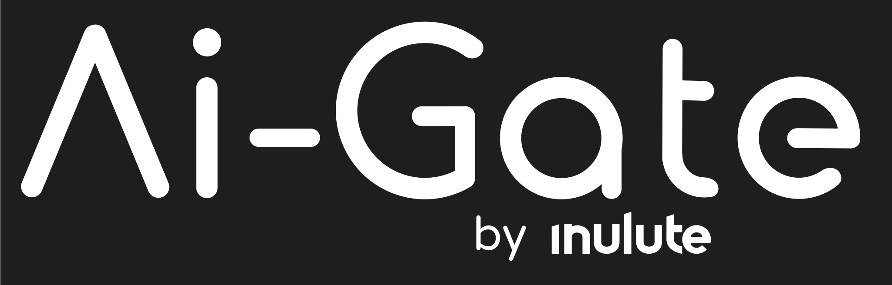
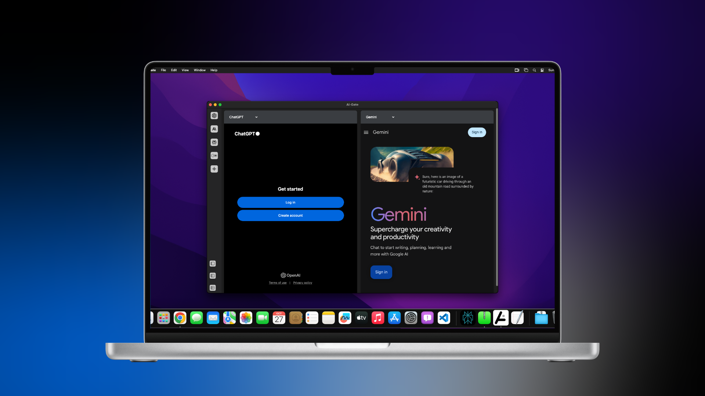
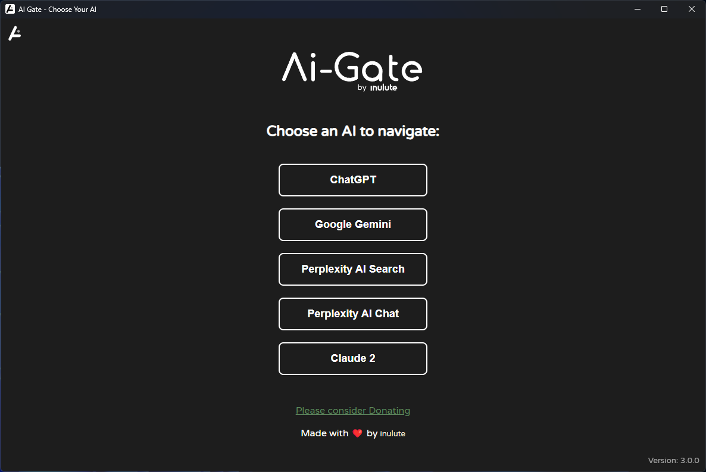
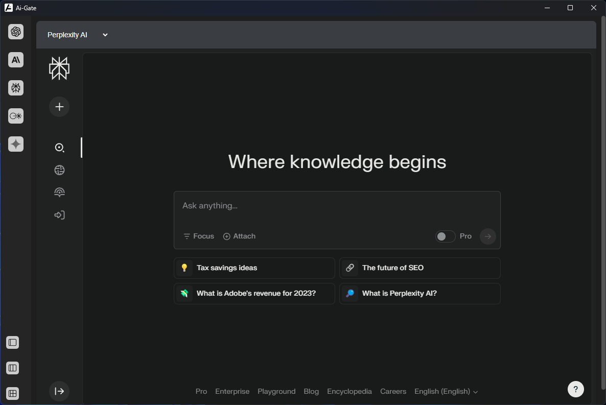
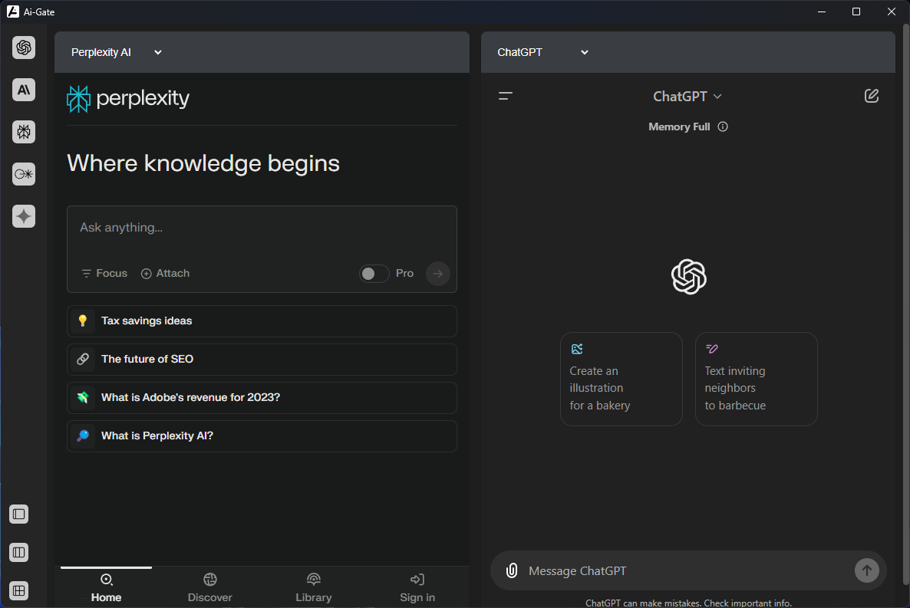
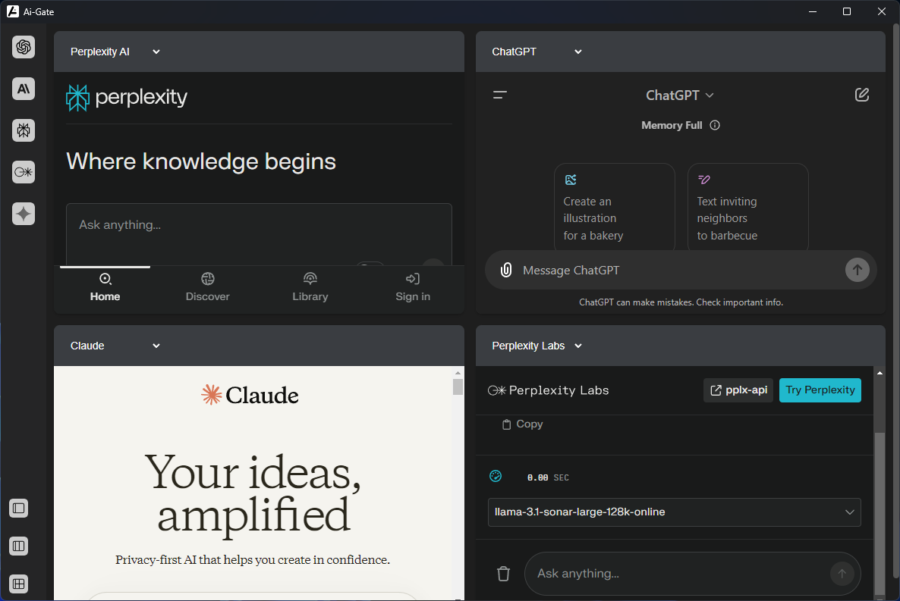

  

---

From AI Gate, you can access ChatGPT, Gemini, Perplexity, Claude all from one easy-to-use app. 🖥️
&nbsp;

  

## ⚙️ Features

- **AI Tool Collection:** Access a curated selection of cutting-edge AI tools in one place. 🧰
- **User-Friendly Interface:** Intuitive and visually appealing interface for seamless interactions. 🎨
- **Fast and Efficient:** Instantly harness the power of AI without any delays or complications. ⚡
- **Cross-Platform Compatibility:** Available for Windows, Linux and macOS. 🖥️
- **Open multiple tools:** Open multiple tools at the same time. 🚀

## 🖼️ Screenshots

| Home                                      | Layout 1                                  |
|:---------------------------------------------:|:--------------------------------------------:|
|  |  |
&nbsp;

| Layout 2                                    | Layout 3                                       |
|:--------------------------------------------:|:--------------------------------------------:|
|  |  |

## 📢 Feedback

We warmly welcome your feedback to improve the AI Gate. If you encounter any issues or have ideas for enhancements, please submit them through GitHub issues.

## 📝 License

AI Gate is released under the GPL-v3 License. Please refer to the [LICENSE](./LICENSE) file for more information.

---